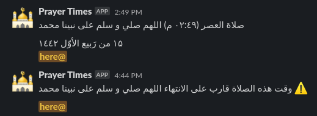

# Prayer times notifier Slack bot :robot:

This worker fetches prayer times :mosque: from a remote API and posts a message to Slack when it's prayer time and when the prayer time is about to end so you're almost sure in sha Allah that you're not missing any prayers :v:.


This is how it looks like :dark_sunglasses:



## Usage

You can run this script either locally or using `docker`.

### Setup locally :computer:

* Install `requests` dependency by running `pip install requests pytz iso3166` 
* Setup an Incoming Webhooks in Slack's Integration: [https://my.slack.com/services/new/incoming-webhook](https://my.slack.com/services/new/incoming-webhook).
* Get the Webhook URL e.g. `https://hooks.slack.com/services/example`.
* Put the Webhook URL into the `config.json` .
* Modify the location variables `CITY` and `COUNTRY` in the config file to match your location.
* The script will use the location specific API e.g. URL = [http://api.aladhan.com/v1/timingsByCity?city=mecca&country=Saudi Arabia&method=5](http://api.aladhan.com/v1/timingsByCity?city=mecca&country=Saudi%20Arabia&method=5) for Mecca, Saudi Arabia based on the variables you set above.
* OPTIONAL: Modify the Slack username (can be any name, you don't have to create the user beforehand) in `prayer_times_slack_bot.py` .
* OPTIONAL: Modify the Slack channel name `SLACK_CHANNEL_NAME` in `prayer_times_slack_bot.py` to post to a certain channel.
* OPTIONAL: Modify the emoji name to be used as user's icon


> the script is meant to be run as a background task, so it keeps scheduling tasks and doesn't exit on it's own.

### Thank you!
Idea and setup steps credits go to [Sholat-Prayer-Times-Slack](https://github.com/ainunnajib/Sholat-Prayer-Times-Slack/)

### Setup using docker :whale:

You can deploy the script directly to a container using `deploy.sh` and this will build and launch the container.


``` bash
chmod u+x deploy.sh # Make the script runnable
./deploy.sh
```

## Note
The mentioned way of getting webhook URL is deprecated and might be removed in the future. Please watch [this](https://youtu.be/6QMQF0zHZ5E) video if you face any issues obtaining your slack webhook URL.
***

#### About deployment
You might want to run this as a task on your PC or using a server. I use DigitalOcean for my development server, check it out [here](https://m.do.co/c/a8242cdca716) (my reference link)